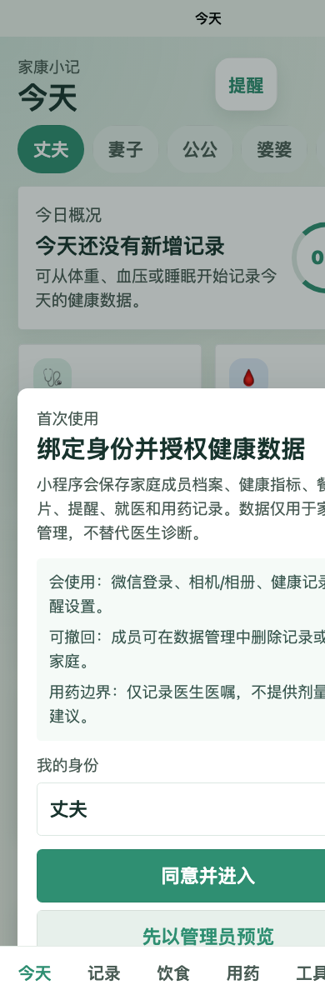
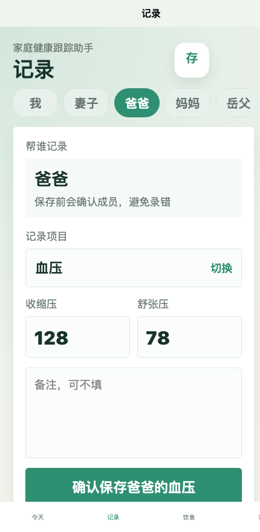
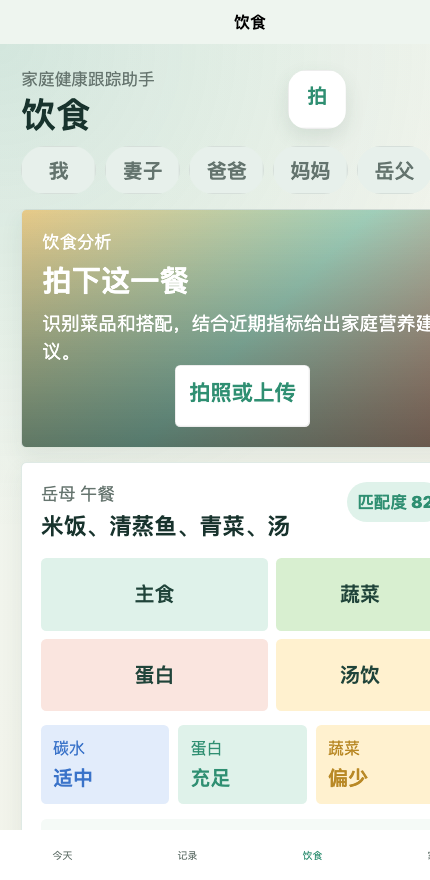
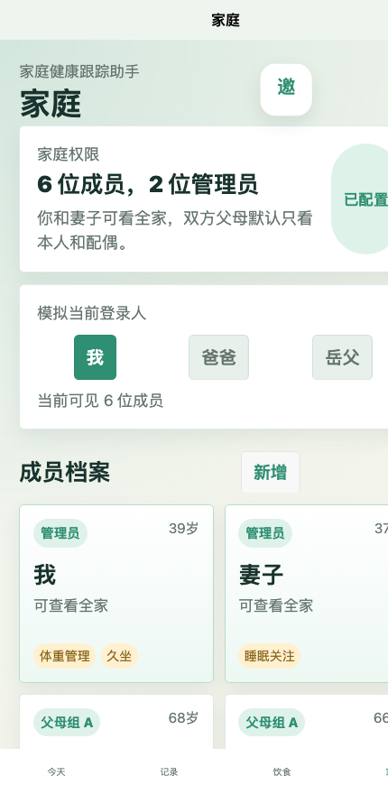

# 家庭健康跟踪助手 Demo

基于 `Uni-app + Vue 3` 的家庭健康小程序 Demo，面向 6 人家庭健康记录场景，支持健康指标录入、餐食分析、用药提醒、就医记录和家庭权限管理。

涉及用药调整请咨询医生或药师，本项目不替代医生诊断。

## 核心能力

- `今天`：家庭健康概况、成员切换、快捷入口、待办提醒、家庭快照。
- `记录`：血压、血糖、体重、心率、睡眠状态等指标录入与趋势查看。
- `饮食`：拍照上传餐食，展示模拟识别结果与营养建议。
- `用药`：今日用药清单、手动添加规则、服药确认、未确认提醒。
- `工具`：4-7-8 呼吸法放松练习，支持轮数选择、暂停、重置和图形化节奏引导。
- `家庭`：6 位成员档案、角色权限、照护关系可见与可操作控制。
- `就医记录`：基本就医信息、诊断结果、开药记录、检查记录、复诊提醒、补充信息。
- `数据管理`：删除申请、导出入口、授权说明。

## 页面预览






## 技术栈

- `Uni-app`
- `Vue 3`
- `Vite`
- `pnpm`
- 本地 Mock 服务：`src/services/mockBackend.js`

## 快速开始

```bash
pnpm install
pnpm dev:h5
```

打开：

```text
http://localhost:5173/
```

## 构建发布

H5 构建：

```bash
pnpm build:h5
```

微信小程序构建：

```bash
pnpm build:mp-weixin
```

构建完成后，在微信开发者工具导入：

```text
dist/build/mp-weixin
```

## 当前版本边界

- 当前为 Demo，核心数据仍使用前端 Mock。
- 饮食分析为模拟结果，已预留图片上传和识别替换点。
- 微信登录、云数据库、云函数、订阅消息暂未接入真实服务。
- 线上发布前需在 `src/manifest.json` 配置真实小程序 `appid`。

## 服务替换点

重点替换文件：[src/services/mockBackend.js](./src/services/mockBackend.js)

- `loginWithWechat`：替换为真实微信登录。
- `bindMember`：替换为成员绑定接口。
- `saveMetricRecord`：替换为记录持久化接口。
- `analyzeMealImage`：替换为图片上传 + AI 识别 + 营养建议。
- `listCareRecords`：替换为就医和复诊数据接口。
- `listMedicationTasks`：替换为今日用药任务接口。
- `confirmMedication`：替换为服药确认接口。
- `createMedicationReminder`：替换为新增提醒接口。
- `requestDataDeletion`：替换为删除申请和审计接口。

## 建议数据库模型

- `families`：家庭信息、管理员。
- `users`：用户与成员绑定关系。
- `members`：成员档案、关系组、权限范围。
- `metricRecords`：健康指标记录。
- `mealRecords`：餐食图片与分析结果。
- `visitRecords`：就医、检查、复诊信息。
- `medicationLogs`：用药记录与确认状态。
- `reminders`：记录/复诊/用药提醒。
- `auditLogs`：代录、删除、导出等操作日志。

## 版本信息

- 当前发布标签：`v0.1.0`
- 首次发布内容：完整 Demo 流程、家庭权限模型、用药页、工具页、就医记录页、自定义底栏适配
